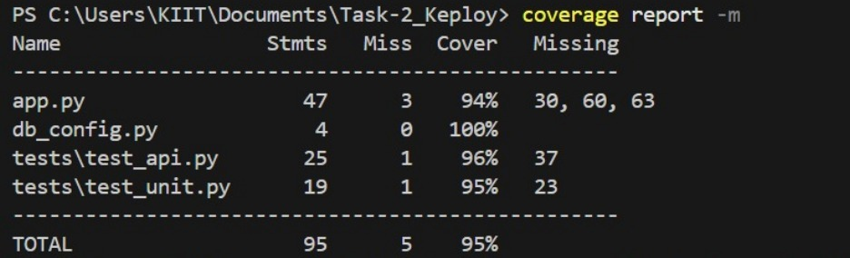
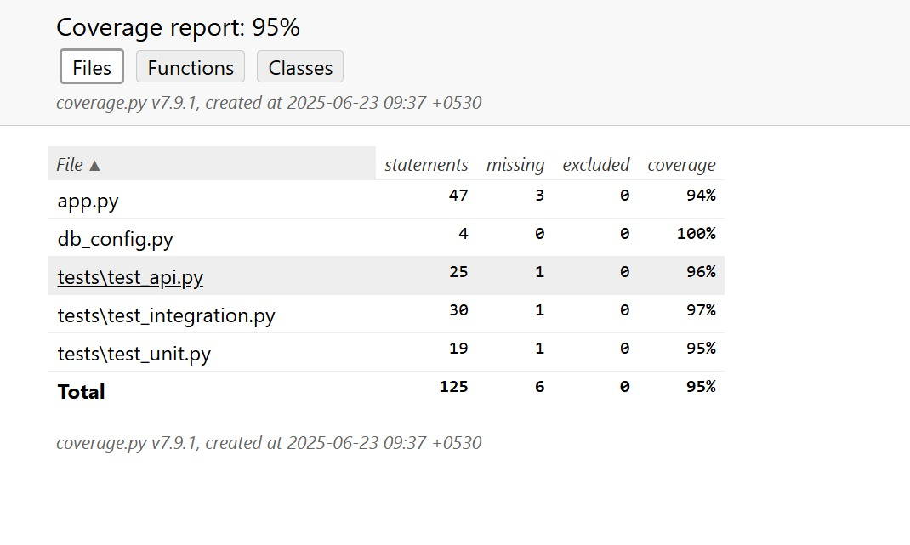

# 📦 Stock_Stack – Flask + MySQL CRUD API

This is a simple full-stack Inventory Manager project built using:

- 🐍 Flask (Python) for the backend API
- 🐬 MySQL as the database
- 💻 HTML + Bootstrap for the frontend UI
- 🧪 `curl` for command-line API testing

---

## 🚀 Features

- View all inventory items
- Add new items
- Update existing items
- Delete items
- Full API support via browser and curl
- Bootstrap-styled responsive frontend

---

## 📁 Project Structure

```
project/
├── app.py # Flask backend server
├── db_config.py # MySQL credentials
├── templates/
│ └── index.html # Web frontend (Bootstrap UI)
├── tests/
│ ├── test_api.py # API + integration tests
│ └── test_unit.py # Unit tests
| |__ test_integration.py
├── API_DOC.md # Full API documentation
├── README.md # Project setup & usage
├── Screenshots/
│ └── Coverage.jpg # Test coverage screenshot
```

---

## 🛢️ MySQL Database Setup

**Database name:** `inventorydb`  
**Table name:** `items`

### ✅ SQL to set up your database:

```sql
CREATE DATABASE inventorydb;

USE inventorydb;

CREATE TABLE items (
  id INT AUTO_INCREMENT PRIMARY KEY,
  name VARCHAR(255),
  quantity INT
);
```

---

## ⚙️ How to Run the Server

1. 🐍 Install Python dependencies:
```bash
pip install flask flask-mysqldb
```

2. 📁 Make sure your frontend file `index.html` is inside the `templates/` folder.

3. ▶️ Run the Flask server:
```bash
python app.py
```

4. 🌐 Open your browser and go to:
```
http://localhost:5000
```

---

## 🌐 How to Use the Frontend

- Enter **item name** and **quantity** in the form
- Click **Add Item**
- Click **Refresh** to view all items
- Items are displayed in a formatted JSON list

---

## 🧪 Interacting with the API via `curl`

Here are some quick examples (run these in your command prompt):

### ➕ Add item:
```bash
curl -X POST http://localhost:5000/api/items ^
-H "Content-Type: application/json" ^
-d "{\"name\":\"Pen\", \"quantity\":10}"
```

### 📋 View all items:
```bash
curl http://localhost:5000/api/items
```

### ✏️ Update item with ID 1:
```bash
curl -X PUT http://localhost:5000/api/items/1 ^
-H "Content-Type: application/json" ^
-d "{\"name\":\"Updated Pen\", \"quantity\":12}"
```

### ❌ Delete item with ID 1:
```bash
curl -X DELETE http://localhost:5000/api/items/1
```

➡️ For full API reference, see [`API_DOC.md`](API_DOC.md)

---
## 🧪 Testing Overview

### ✅ Testing Frameworks Used:

| Tool                | Purpose                             |
|---------------------|-------------------------------------|
| `unittest`          | Python’s built-in test framework    |
| `unittest.mock`     | Mocking DB for isolated unit tests  |
| `Flask test client` | Simulate API requests               |
| `coverage`          | Code coverage tracking              |

---
### 🧪 Running Tests

This project includes unit, integration, and API tests using Python’s built-in `unittest` and `coverage`.

### Run all tests:
```bash
python -m unittest discover tests
coverage run -m unittest discover tests
coverage report -m


```
### 🧪 Test Coverage



### 🧪  HTML Test Coverage




## 👤 Author

Made with ❤️ by **Sarvansh**
